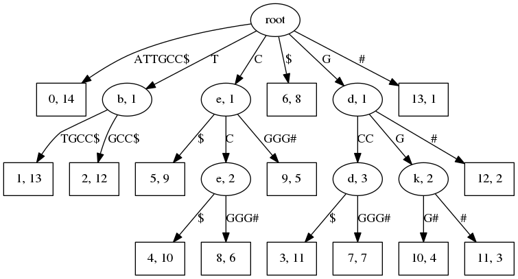

# suffix_trees
Python implementation of Suffix Trees and Generalized Suffix Trees. Also provided methods with typcal applications of STrees and GSTrees. 

## Installation

```bash
pip install git+https://github.com/Nanguage/suffix-trees.git
```

## Usage

### Suffix tree construction

```python
from suffix_trees import STree

# Suffix-Tree example.
st = STree.STree("abcdefghab")
print(st.find("abc")) # 0
print(st.find_all("ab")) # [0, 8]

# Generalized Suffix-Tree example.
a = ["xxxabcxxx", "adsaabc", "ytysabcrew", "qqqabcqw", "aaabc"]
st = STree.STree(a)
print(st.lcs()) # "abc"
```

### Tree visualization

```python
from suffix_trees.STree import STree
from suffix_trees.visualize import VisualizeTree

seq1 = "ATTGCC"
seq2 = "GCCGGG"

st = STree([seq1, seq2])
dot = v.to_graphviz()

dot
```


